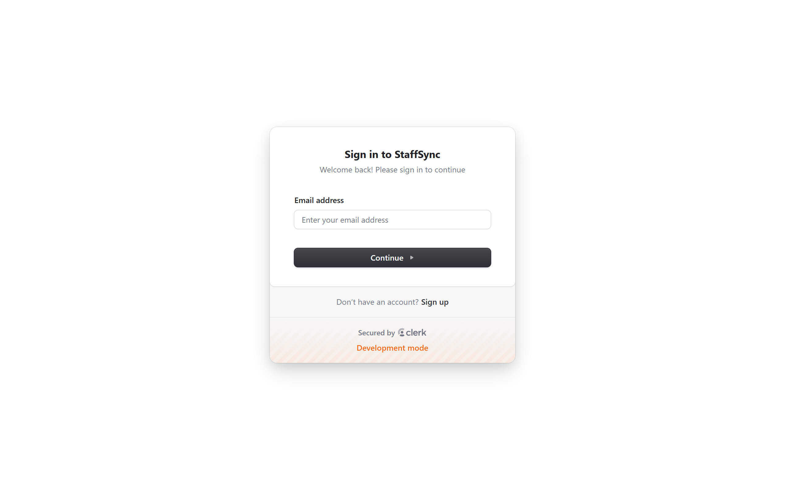
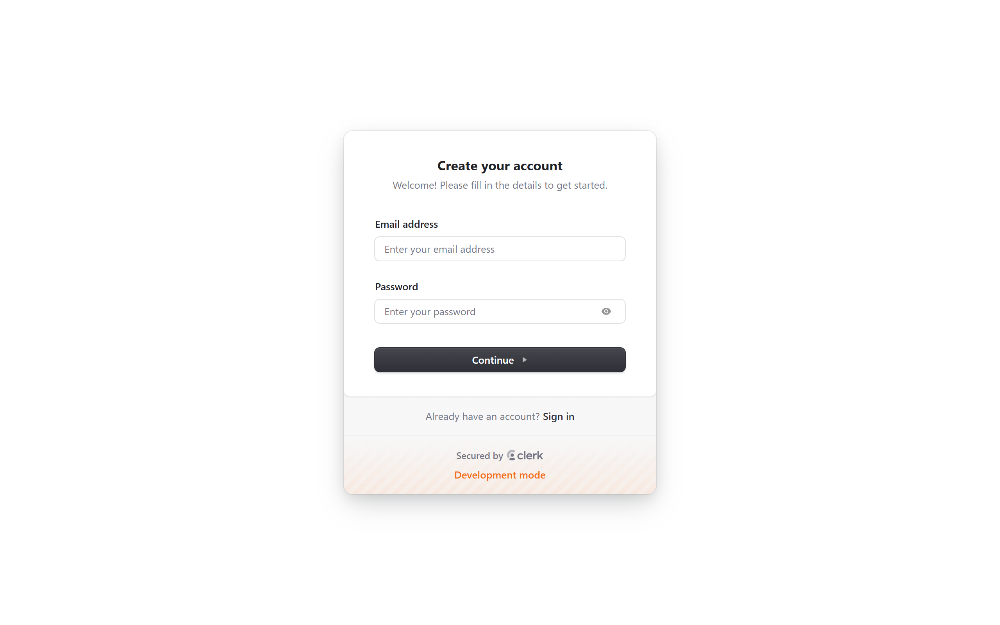
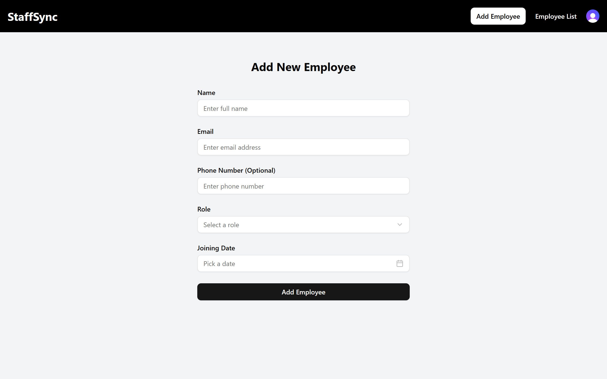
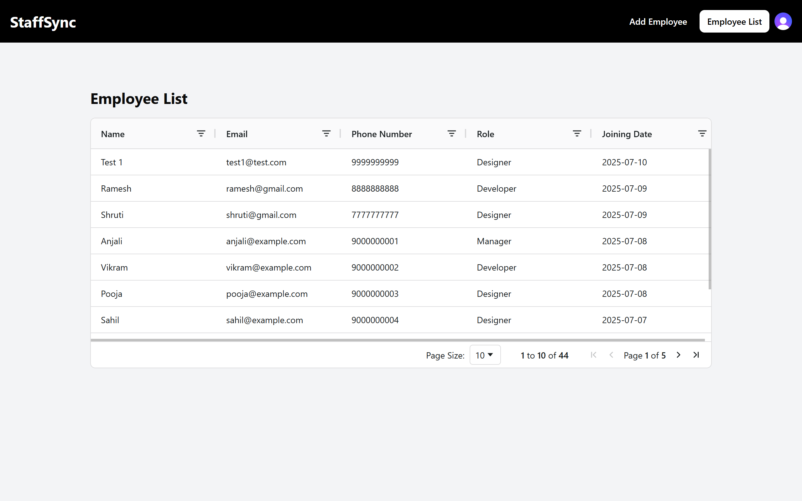

# StaffSync

A modern, full-featured Employee Management System built with React, TypeScript, and cutting-edge web technologies. This application provides a seamless experience for managing employee data with robust authentication, form validation, and email notifications.

## Features

### Authentication

- **Clerk Integration**: Secure user authentication system
- **Protected Routes**: Only authenticated users can access the application
- **Session Management**: Automatic session handling and user state management

### Employee Management

- **Add Employee**: Comprehensive form with validation for adding new employees
- **View Employees**: Interactive table displaying all employee data
- **Data Persistence**: Local storage with easy migration path to cloud databases

### Form & Validation

- **React Hook Form**: Efficient form state management
- **Zod Validation**: Type-safe form validation with detailed error messages
- **ShadCN UI**: Clean, modern, and accessible UI components

### Data Display

- **AG Grid**: Professional data table with sorting and filtering capabilities
- **Responsive Design**: Optimized for desktop and mobile devices

### Email Notifications

- **EmailJS Integration**: Automatic email notifications when employees are added
- **Template-based Emails**: Professional email templates for notifications

## Getting Started

### Prerequisites

- Node.js (v18 or higher)
- npm or yarn
- Git

### Installation

1. **Clone the repository**

   ```bash
   git clone https://github.com/Pratikshya01/staff-sync.git
   cd staff-sync
   ```

2. **Install dependencies**

   ```bash
   npm install
   ```

3. **Set up environment variables**
   Create a `.env` file in the root directory and add:

   ```env
   VITE_CLERK_PUBLISHABLE_KEY=your_clerk_publishable_key
   VITE_EMAILJS_SERVICE_ID=your_emailjs_service_id
   VITE_EMAILJS_TEMPLATE_ID=your_emailjs_template_id
   VITE_EMAILJS_PUBLIC_KEY=your_emailjs_public_key
   ```

4. **Run the development server**

   ```bash
   npm run dev
   ```

5. **Open your browser**
   Navigate to `http://localhost:5173`

## Project Structure

```
staff-sync/
├── public/
│   └── vite.svg                # Vite logo
├── src/
│   ├── assets/                 # Static assets
│   │   └── react.svg
│   ├── components/             # Reusable UI components
│   │   ├── ui/                # ShadCN UI components
│   │   │   ├── button.tsx     # Button component
│   │   │   ├── calendar.tsx   # Calendar component
│   │   │   ├── form.tsx       # Form component
│   │   │   ├── input.tsx      # Input component
│   │   │   ├── label.tsx      # Label component
│   │   │   ├── popover.tsx    # Popover component
│   │   │   └── select.tsx     # Select component
│   │   ├── DashboardLayout.tsx # Dashboard layout wrapper
│   │   ├── LoadingSpinner.tsx  # Loading spinner component
│   │   ├── Navbar.tsx          # Navigation bar
│   │   ├── ProtectedRoute.tsx  # Route protection wrapper
│   │   └── PublicRoute.tsx     # Public route wrapper
│   ├── config/                 # Configuration files
│   │   └── index.ts           # App configuration
│   ├── lib/                    # Utility functions and configurations
│   │   └── utils.ts           # Utility functions
│   ├── pages/                  # Page components
│   │   ├── protected/         # Protected pages (authenticated)
│   │   │   ├── AddEmployee.tsx # Add employee form page
│   │   │   ├── EmployeeList.tsx # Employee list table page
│   │   │   └── index.ts       # Protected pages exports
│   │   ├── public/            # Public pages (unauthenticated)
│   │   │   ├── SignInPage.tsx # Sign in page
│   │   │   ├── SignUpPage.tsx # Sign up page
│   │   │   └── index.ts       # Public pages exports
│   ├── services/               # API and service functions
│   │   └── localStorage.ts     # Local storage service
│   ├── types/                  # TypeScript type definitions
│   │   └── employee.ts         # Employee type definitions
│   ├── App.tsx                 # Main app component
│   ├── index.css               # Global styles
│   ├── main.tsx                # App entry point
│   └── vite-env.d.ts           # Vite environment types
├── .gitignore                  # Git ignore rules
├── components.json             # ShadCN UI configuration
├── eslint.config.js            # ESLint configuration
├── index.html                  # HTML entry point
├── package.json                # Project dependencies
├── package-lock.json           # Dependency lock file
├── tsconfig.app.json           # TypeScript app configuration
├── tsconfig.json               # TypeScript configuration
├── tsconfig.node.json          # TypeScript Node configuration
├── vite.config.ts              # Vite configuration
└── README.md                   # Project documentation
```

## Implementation Approach

### Step 1: Project Foundation

- Set up React project with TypeScript using Vite
- Configured ShadCN UI components for consistent design system
- Established project structure and initial configurations

### Step 2: Core UI and Routing

- Implemented routing with React Router
- Created dashboard layout and navigation structure
- Built the Add Employee page with form components
- Added calendar and popover components for date picker functionality

### Step 3: Data Management and Form Handling

- Implemented local storage service for employee data persistence
- Set up form submission handling with proper data validation

### Step 4: User Experience Enhancements

- Added toast notification system for user feedback
- Implemented navigation flow from add employee to employee list
- Added loading spinner component for better user experience
- Fixed layout margins and UI consistency across input components

### Step 5: Employee List View

- Integrated AG Grid for professional data table display
- Added sorting and filtering capabilities for employee data

### Step 6: Authentication System

- Set up Clerk authentication service
- Created public and protected route components for access control
- Built sign-in and sign-up pages with proper styling
- Added authentication-based routing and navigation guards

### Step 7: Authentication UI Integration

- Integrated UserButton component from Clerk in navigation bar
- Implemented loading states during authentication processes
- Configured proper sign-out URL handling
- Added authentication-based route protection throughout the app

### Step 8: Code Organization and Refinements

- Created barrel files for protected pages to maintain clean codebase
- Refactored authentication configuration for better maintainability
- Ensured consistent UI styling across all form inputs

### Step 9: Email Integration

- Integrated EmailJS for automated email notifications
- Set up email templates for employee addition notifications
- Configured environment variables for email service
- Added email sending functionality on successful form submission

### Step 10: Final Configuration

- Refactored to use centralized configuration for Clerk publishable key
- Ensured proper environment variable management
- Finalized authentication and email service configurations

## Data Persistence

### Current Implementation: Local Storage

The application currently uses browser's localStorage for data persistence:

### Future Database Integration

The current localStorage implementation can be easily migrated to Firebase Firestore for a production-ready solution:

#### Firebase Firestore Migration

**Step 1: Project Setup**

- Create Firebase project and enable Firestore Database
- Install Firebase SDK and configure authentication
- Set up environment variables for Firebase config

**Step 2: Database Structure**

- Design employee collection schema with proper field types
- Configure security rules for data access
- Set up indexing for efficient queries

**Step 3: Service Layer Migration**

- Replace localStorage methods with Firestore operations
- Implement CRUD operations using Firestore SDK
- Add real-time listeners for live data updates

**Step 4: Authentication Integration**

- Integrate Firebase Auth with existing Clerk setup
- Configure user-based data access rules
- Set up role-based permissions

**Step 5: Testing and Deployment**

- Test data migration with sample data
- Implement error handling and retry mechanisms
- Deploy with proper environment configuration

## Technology Integrations

### Clerk Authentication

```typescript
// Clerk setup in main.tsx
import { StrictMode } from "react";
import { createRoot } from "react-dom/client";
import "./index.css";
import App from "./App.tsx";
import { ClerkProvider } from "@clerk/clerk-react";
import { CLERK_PUBLISHABLE_KEY } from "./config/index.ts";

if (!CLERK_PUBLISHABLE_KEY) {
  throw new Error("Missing Publishable Key");
}

createRoot(document.getElementById("root")!).render(
  <StrictMode>
    <ClerkProvider
      publishableKey={CLERK_PUBLISHABLE_KEY}
      afterSignOutUrl="/signin"
    >
      <App />
    </ClerkProvider>
  </StrictMode>
);
```

### EmailJS Integration

```typescript
// Email service setup
import emailjs from "@emailjs/browser";

async function sendEmail(values: EmployeeFormData) {
  try {
    await emailjs.send(EMAILJS_SERVICE_ID, EMAILJS_TEMPLATE_ID, values, {
      publicKey: EMAILJS_PUBLIC_KEY,
    });
    toast.success(
      "Employee added successfully. An email has been sent with the employee details."
    );
    navigate("/list");
  } catch {
    toast.error("Something went wrong! Please try again.");
  } finally {
    setIsLoading(false);
  }
}
```

## Routes

| Route   | Component       | Description                        |
| ------- | --------------- | ---------------------------------- |
| `/`     | DashboardLayout | Main dashboard (redirects to /add) |
| `/add`  | AddEmployee     | Form to add new employees          |
| `/list` | EmployeeList    | Table view of all employees        |

## Future Enhancements

- [ ] **Employee Profile Pages**: Detailed view for individual employees
- [ ] **Export Functionality**: Export employee data to CSV/PDF
- [ ] **Bulk Operations**: Add, edit, or delete multiple employees
- [ ] **Employee Photos**: Upload and display employee profile pictures
- [ ] **Search Functionality**: Global search across all employee data

## Screenshots

### Sign In Page



### Sign Up Page



### Add Employee Form



### Employee List Table



---
